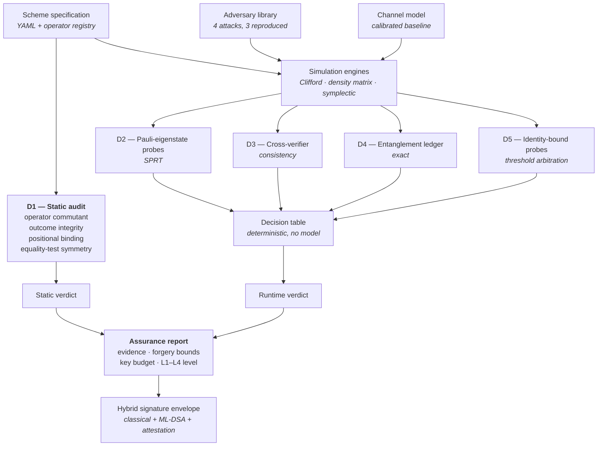

# Pramāṇa

**A protocol assurance testbed for teleportation-based quantum digital signatures.**

Pramāṇa takes a quantum signature scheme as input, runs a library of reproduced published
attacks against it, and returns an auditable verdict on whether the scheme holds up — using
only physics and classical statistics, with no machine learning anywhere in the detection
path.

*Pramāṇa* (प्रमाण) is the Sanskrit term for a valid means of proof.

---

## Why this exists

Quantum digital signatures promise information-theoretic security: unlike RSA and ECC, no
future computer can break them by brute force. But published cryptanalysis shows real
schemes are still forgeable — not because the physics fails, but because of how the
protocols around the physics are engineered.

Three results define the problem:

- **Gao et al. (2011)** — the receiver can forge the sender's signature under a known-message attack, and the sender can disavow her own signatures.
- **Choi, Chang & Hong (2011)** — a simple existential forgery validly modifies the message–signature pair, because the Pauli operators used for encryption commute with each other. **The forged signature passes verification.**
- **Zhang et al. (2013)** — proved that improved encryption alone cannot prevent receiver forgery without additional security strategies.

Since a forged signature verifies as legitimate, any detector that watches accept/reject
outcomes is structurally blind to the most important attack. And since prevention is
provably incomplete, detection is one of the strategies the impossibility result requires.

That is what this project builds.

---

## Architecture



The two verdict paths are deliberately separate. A scheme can be **statically vulnerable**
while a given session shows **no runtime anomaly** — that is precisely what a Choi-class
forgery looks like, and reporting both is the point rather than a limitation.

---

## The five detectors

Different threats perturb different observables, so each needs a different detector. One
threshold turned up and down cannot cover them.

| Detector | Watches | Catches | Nature |
|----------|---------|---------|--------|
| **D1** | The scheme's algebraic structure | Receiver forgery via commuting operators | Deterministic, pre-runtime |
| **D2** | Pauli-eigenstate probe outcomes | Outsider forgery, unauthorised verification, channel manipulation | Statistical (SPRT) |
| **D3** | Agreement across verifiers | Repudiation, disavowal | Deterministic consistency check |
| **D4** | Entangled-pair freshness | Replay | Exact ledger lookup |
| **D5** | Identity-bound probe outcomes | Impersonation | Statistical |

**D1 is the load-bearing component.** It reads the scheme's operator structure and reports
`VULNERABLE` before any simulation runs, catching the attack class that produces zero
runtime evidence. It is constructive — it returns the forging operator as a witness, not
just a verdict.

### Threat coverage

| Threat | Disturbs | Detector |
|--------|----------|----------|
| Forgery — receiver, commuting operators | Nothing; signature verifies | D1 |
| Forgery — outsider, guessed corrections | Verification outcome | D2 |
| Impersonation | Identity-bound probes | D5 |
| Replay | Pair index, probe freshness | D4 |
| Unauthorised verification | Probes go maximally mixed | D2 |
| Quantum channel manipulation | Probe error rate vs. baseline | D2 |
| Repudiation | Verifier disagreement | D3 |
| Malicious arbitrator | D3 and D5 together | Decision table |

---

## Threat model

Security claims are conditional on stated assumptions. Both are listed.

**Assumptions**

| ID | Assumption |
|----|------------|
| A-1 | A one-time pre-shared authentication seed exists between each party pair. Standard in QKD, where the field says *key growing* for this reason. |
| A-2 | At most `t−1` of `n` arbitrators collude. |
| A-3 | The channel is attacker-free during initial calibration, with drift detection as partial mitigation. |
| A-4 | Messages are classical, or quantum states with a small number of non-Clifford qubits. |

**Guarantees**

| ID | Guarantee |
|----|-----------|
| G-1 | Information-theoretic security throughout the signature path, given A-1. |
| G-2 | Simulation cost polynomial in signature length; exponential only in non-Clifford message qubits. |
| G-3 | Malicious-arbitrator detection at `n ≥ 2`; identification at `n ≥ 3` with majority. |
| G-4 | All detection is deterministic algebra, exact ledger lookup, or statistical tests with bounded error rates. No trained model anywhere. |

### Out of scope

Stated rather than omitted:

- **Physical side channels** — detector blinding, photon-number splitting, Trojan-horse attacks. These cannot be caught by protocol simulation.
- **Denial of service** against the quantum link.
- **Initial seed key distribution.**
- **Non-Pauli forging operators.** D1 decides the published attack class, which is a Pauli attack.

Nothing here runs on quantum hardware. The vulnerabilities being detected are properties of
protocol design, not of devices, which is why they can be found in simulation — and why they
should be found before schemes are standardised and embedded in long-lifecycle equipment.

---

## How security is established

**Information-theoretic authentication.** The classical channel carrying correction bits is
authenticated with Wegman–Carter MACs. The hash key is reusable; only the one-time pad on
the tag must be fresh, so key consumption is tag-length bits per message rather than
message-length. Key material is replenished from entanglement-based generation using the
same Bell pairs the protocol already distributes, so the system sustains its own
authentication key from a one-time seed.

**Threshold arbitration.** Arbitrator key material is split via Shamir secret sharing.
Probe expectations require `t` of `n` shares to reconstruct, so no single arbitrator is the
reference for its own audit.

**Polynomial-time simulation.** The protocol is Clifford, so simulation is polynomial in
signature length by Gottesman–Knill. Non-Clifford message qubits are handled by
stabilizer-rank decomposition, whose cost is exponential only in the non-Clifford count.

---

## Build status

| Layer | Component | Status |
|-------|-----------|--------|
| 0 | Scaffold, environment verification, tooling | Complete |
| 1 | Protocol specification and operator registry | In progress |
| 2 | Simulation engines | Not started |
| 3 | Protocol operations | Not started |
| 4 | Cryptographic foundations | Not started |
| 5 | Attack library | Not started |
| 6 | Detection engine | Not started |
| 7 | Decision table | Not started |
| 8 | Bridge and assurance report | Not started |
| 9 | API | Not started |
| 10 | Dashboard | Not started |

Each layer has an exit gate. No layer begins before the previous one's tests pass.

---

## Getting started

Requires Python 3.12.

```bash
git clone <repo-url>
cd pramana

python -m venv .venv
source .venv/bin/activate        # Windows: .venv\Scripts\activate
pip install -e ".[dev]"
```

Verify the environment before anything else. This exercises the exact library calls the
project depends on rather than trusting version numbers:

```bash
python scripts/verify_env.py
pytest tests/test_env.py -v
```

Run the checks:

```bash
ruff check .
ruff format --check .
mypy src/
pytest
```

### Post-quantum bridge (optional)

`liboqs-python` builds native libraries at import time and is not installed by default. The
bridge degrades gracefully without it and its tests skip with a stated reason.

```bash
pip install -e ".[pqc]"
PRAMANA_ENABLE_PQC=1 python scripts/verify_env.py
```

---

## Repository layout

```
src/pramana/
  spec/          scheme specification, operator registry
  engines/       Clifford (Stim), noise (Aer), symplectic
  protocol/      signing, verification, probe rounds
  crypto/        Wegman–Carter, key pool, Shamir, arbitration
  attacks/       adversary library
  detectors/     D1–D5
  decision/      deterministic verdict table
  bridge/        PQC adapter, envelope, assurance report
  api/           FastAPI service

scripts/         environment verification, citation checks
tests/           unit, regression, determinism, integration
```

---

## Engineering standards

The project enforces a small set of rules mechanically, because a tool that reports on
cryptographic security has to be right rather than plausible.

- **No invented physics.** Any protocol step not derived in the design docs or traceable to a paper raises `NotImplementedError` naming the source required, rather than being implemented from a plausible guess.
- **No invented citations.** A pre-commit hook enforces an allowlist. Every reference has been read.
- **Tests assert derived values.** Expected values come from theory with a stated tolerance, never from capturing current output.
- **Runtime API verification.** Library calls are verified against installed versions rather than written from memory. This caught two API changes during Layer 0.
- **Determinism.** Every simulation entry point takes an explicit seed. Same seed, same output, enforced in CI.
- **A verification ledger.** Every non-obvious claim is recorded as `VERIFIED`, `ASSUMPTION`, or `UNVERIFIED`. Nothing marked `UNVERIFIED` appears in results or presentations.
- **No machine learning dependencies.** Enforced by test. The problem statement prohibits AI/ML in the detection pipeline, and for a certification tool a deterministic verdict is auditable where a model's confidence score is not.

---

## References

**Cryptanalysis reproduced**

- Gao, Qin, Guo, Wen — *Cryptanalysis of the arbitrated quantum signature protocols*, Phys. Rev. A **84**, 022344 (2011). [arXiv:1106.4398](https://arxiv.org/abs/1106.4398)
- Choi, Chang, Hong — *Security problem on arbitrated quantum signature schemes*, Phys. Rev. A **84**, 062330 (2011). [arXiv:1106.5318](https://arxiv.org/abs/1106.5318)
- Su, Li — *Improved group signature scheme based on quantum teleportation*, Int. J. Theor. Phys. **53**(4), 1208–1216 (2014)
- Zou, Qiu — *Security analysis and improvements of arbitrated quantum signature schemes*, Phys. Rev. A **82**, 042325 (2010)

**Central argument**

- Zhang, Qin, Sun et al. — *Reexamination of arbitrated quantum signature: the impossible and the possible*, Quantum Inf. Process. **12**(9), 3127–3141 (2013)

**Protocols modelled**

- Zeng, Keitel — *Arbitrated quantum-signature scheme*, Phys. Rev. A **65**, 042312 (2002)
- Li, Chan, Long — Phys. Rev. A **79**, 054307 (2009)
- Wen, Tian, Ji, Niu — *A group signature scheme based on quantum teleportation*, Phys. Scr. **81**(5), 055001 (2010)
- Yang, Zhou, Teng, Wen — *Arbitrated quantum signature with an untrusted arbitrator*, Eur. Phys. J. D **61**, 773–778 (2011)

**Foundations**

- Gottesman, Chuang — *Quantum Digital Signatures* (2001). [arXiv:quant-ph/0105032](https://arxiv.org/abs/quant-ph/0105032)
- Aaronson, Gottesman — *Improved simulation of stabilizer circuits*, Phys. Rev. A **70**, 052328 (2004)
- Bravyi, Gosset — *Improved classical simulation of quantum circuits dominated by Clifford gates*, Phys. Rev. Lett. **116**, 250501 (2016)
- Bravyi, Browne, Calpin, Campbell, Gosset, Howard — *Simulation of quantum circuits by low-rank stabilizer decompositions*, Quantum **3**, 181 (2019). [arXiv:1808.00128](https://arxiv.org/abs/1808.00128)
- Boykin, Roychowdhury — *Optimal encryption of quantum bits*, Phys. Rev. A **67**, 042317 (2003). [arXiv:quant-ph/0003059](https://arxiv.org/abs/quant-ph/0003059)
- Wegman, Carter — *New hash functions and their use in authentication and set equality*, J. Comput. Syst. Sci. **22**(3), 265–279 (1981)
- Gisin, Fasel, Kraus, Zbinden, Ribordy — *Trojan-horse attacks on quantum-key-distribution systems*, Phys. Rev. A **73**, 022320 (2006)

**Standards and policy**

- NIST FIPS 204 — Module-Lattice-Based Digital Signature Standard (ML-DSA)
- NIST FIPS 205 — Stateless Hash-Based Digital Signature Standard (SLH-DSA)
- DST — *Implementation of Quantum Safe Ecosystem in India: Report of the Task Force* (2026)
- Controller of Certifying Authorities, India — IT Act 2000 PKI framework

---

## Context

Built for Smart India Hackathon 2026, problem statement 26141, *Quantum-Inspired Cyber
Threat Detection for Digital Signature Security* (Egreen Quanta).

India's DST Task Force proposes quantum-safe critical infrastructure by 2029 and
certification laboratories operational from December 2026, including capacity to certify
quantum communication products alongside post-quantum algorithms. No tool currently exists
for evaluating quantum signature protocols against known attacks. This is that tool.

## Development

Portions of this codebase were written with AI assistance under human review. Every
cryptographic claim is traced to a cited source in the verification ledger, and every
derivation was checked against the original paper before implementation.